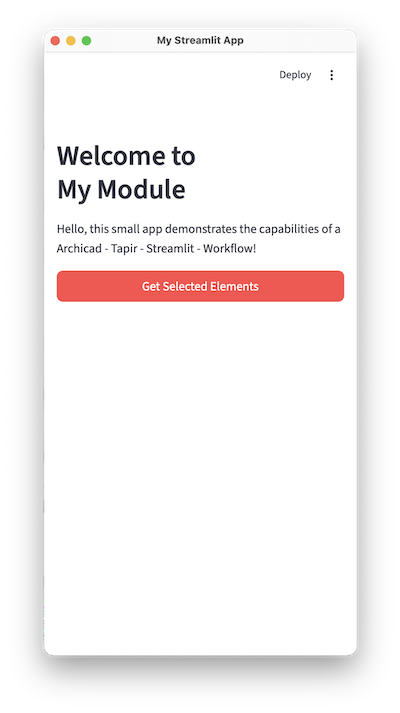

# ACStreamlit

A demo and template project for building **streamlit apps** that run directly inside **Archicad** – powered by [tapir](https://github.com/ENZYME-APD/tapir-archicad-automation).

The app is rendered in a standalone native window via [pywebview](https://pywebview.flowrl.com/) and communicates with Archicad through the tapir interface.



---

## Features

- **Modular** – Each module lives in its own folder under `modules/` with its own streamlit UI.
- **Easy to extend (I think)** – Create a new module folder, copy and adjust the `entry_point.py` – done.
- **Browserlike window** – streamlit runs in the background; the UI is displayed in a native window via pywebview (you can even open an arbitrary URL).
- **Archicad integration** – Execute tapir/Official commands directly from your streamlit app through `ac_funcs/aclib` (copied from the tapir repo).
- **Opt out streamlit/other services** – The streamlit server starts when the window opens and shuts down when the window closes. You can react to those events to start/stop other services as well, like clearing highlights in Archicad when the window closes.

## Possibilities/Use Cases
- **Custom tools** – Build custom Archicad tools with a rich UI, e.g. for element selection, data visualization, or batch operations.
- **Connect to external services** – Integrate with external APIs or databases to bring in additional data or functionality.


---

## Project Structure

```
ACStreamlit/
├── entry_point.py              # Entry point – launches a specific module
├── run_module.py               # Launcher: streamlit server + pywebview window
├── config_example.json         # Example tapir configuration
├── pyproject.toml
├── LICENSE                     # MIT
│
├── ac_funcs/                   # Helper functions for Archicad communication
│   ├── aclib/                  # tapir / Archicad JSON Command API
│   └── get_selected_elements.py
│
└── modules/
    └── MyModule/               # Example module
        ├── __init__.py
        └── ui.py               # streamlit UI for this module
```

---

## Prerequisites

- **Python ≥ 3.13** (not sure, didn't test with earlier versions)
- **Archicad** with the [tapir Add-On](https://github.com/ENZYME-APD/tapir-archicad-automation) installed
- Dependencies (managed via `pyproject.toml`):
  - `streamlit`
  - `pywebview`
  - `archicad`
  - `watchdog` (optional,useful for hot-reload)

---

## Installation

```bash
# Clone the repository
git clone https://github.com/fertegi/ACStreamlit.git
cd ACStreamlit

# Create a virtual environment & install dependencies (recommended with uv)
uv sync
```

---

## Usage

### Running a Module

Each module has its own `entry_point.py`. To run the included example module:

```bash
python entry_point.py
```

This starts a streamlit server in the background and opens a pywebview window displaying the app. When the window is closed, the server is automatically shut down.

### Creating Your Own Module

1. **Create a new folder** under `modules/`, e.g. `modules/MyNewModule/`.
2. **Add a `ui.py`** in the new folder – this is the streamlit UI:

   ```python
   import streamlit as st
   from ac_funcs.get_selected_elements import get_selected_elements

   st.header("My New Module")

   if st.button("Get Elements"):
       elements = get_selected_elements()
       for elem in elements:
           st.write(elem)
   ```

3. **Copy `entry_point.py`** (or create a new one) and point it to your module:

   ```python
   import run_module
   from pathlib import Path

   st_filepath = Path(__file__).parent / "modules/MyNewModule/ui.py"
   st_port = 8501
   window_config = {
       "window_title": "My New Module",
       "url": f"http://localhost:{st_port}",
       "width": 400,
       "height": 800,
       "on_top": True,
       "resizable": True,
       "streamlit_file": str(st_filepath),
       "streamlit_port": st_port,
   }

   run_module.main(**window_config)
   ```

4. **Run it** with `python entry_point.py` (or your new entry point).

---

## Dependency Management
Dependencies are managed via `pyproject.toml` using [uv](https://pypi.org/project/uv/). But in some cases you might want to use inline declarations in the entry_point files. In that case, make sure to also add the dependencies to `pyproject.toml` to keep everything in sync.

At the top of your `entry_point.py`, you can declare dependencies like this:
```
# /// script
# requires-python = ">=3.13"
# dependencies = [
#    "archicad>=28.3000",
#    "pywebview>=5.4",
#    "streamlit>=1.47",
# ]
# ///
```

## Configuration (tapir)

The file `config_example.json` shows how to register a module with tapir:
You can add this (or your modified version) repo to your `config.json`, which is usually located in "Documents/tapir",after you run tapir for the first time.
```json
{
    "repositories": [
        {
            "repoOwner": "fertegi",
            "repoName": "ACStreamlit",
            "relativeLoc": "",
            "displayName": "MyModule",
            "includePattern": "entry_point",
            "excludePattern": "",
            "excludeFromDownloadPattern": ""
        },

    ],
    "askUpdatingAddOnBeforeEachExecution": true
}
```

---

## Contributing

Pull requests from the community are welcome! Whether it's bug fixes, or improvements – feel free to open a PR.

---

## License

This project is licensed under the **MIT License** – see [LICENSE](LICENSE) for details.

**No warranty.** The software is provided "as is", without warranty of any kind.
